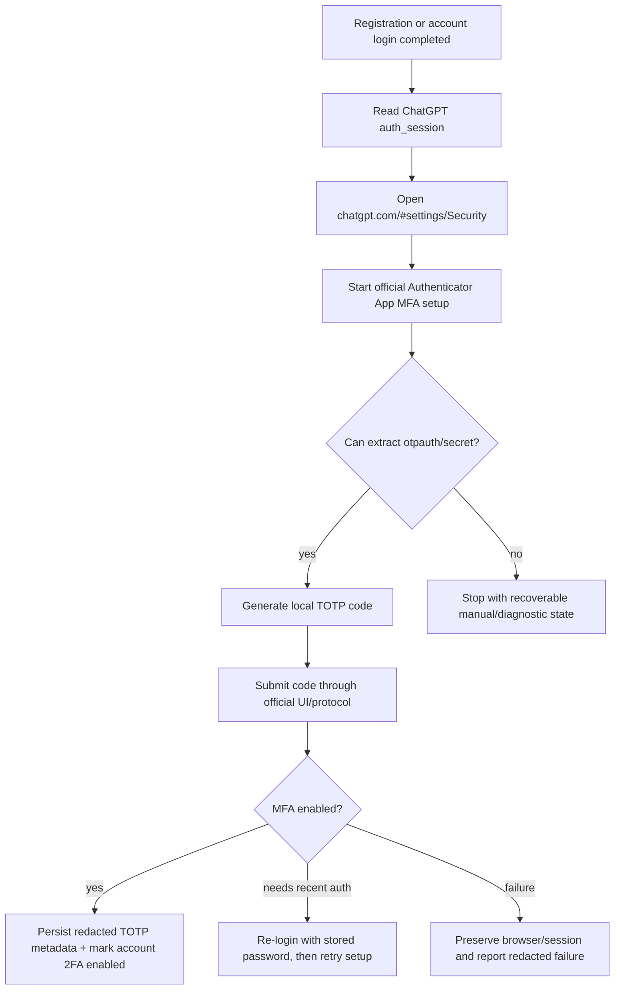

# ChatGPT Official UI/Protocol 2FA Enablement

## Overview

Add first-party ChatGPT/OpenAI 2FA enablement for managed accounts without using the external Nerver-style `/api/v1/totp/enable` service from the reference project. The preferred path is official web UI automation in `Settings > Security`; a first-party protocol path may be used only after a characterization spike confirms the exact OpenAI browser requests and failure modes.

## Problem Frame

AutoTeam-F already creates/logs into ChatGPT accounts and persists `auth_session` material. The next step is to enable 2FA for those accounts in a way that stays tied to OpenAI's official account UI/protocol instead of delegating sensitive session/cookie material to a third-party service. Once 2FA is enabled, every later login/session-refresh flow must also handle TOTP challenges using the stored secret.

## Requirements Trace

- R1. Enable Authenticator App / TOTP MFA through OpenAI official UI or first-party browser protocol.
- R2. Do not call or depend on external Nerver-style TOTP enablement APIs.
- R3. Persist enough 2FA metadata to log in later: secret, masked secret, enabled timestamp, status, and optional otpauth/factor metadata when available.
- R4. Handle existing-account TOTP login challenges using locally stored secrets.
- R5. Keep sensitive values out of progress logs, task history, exports unless explicitly requested.
- R6. Preserve existing registration, `auth_session`, OAuth, and account-pool behavior when 2FA is disabled.

## Scope Boundaries

- This plan targets Authenticator App / TOTP first.
- Passkey enablement is deferred to a separate task.
- Organization-level MFA enforcement is out of scope; OpenAI Help currently says admins cannot enforce MFA at workspace/API Platform organization level.
- No direct dependency on `https://cha.nerver.cc` or equivalent third-party enablement APIs.

### Deferred to Separate Tasks

- Passkey setup and passkey-backed login recovery.
- Bulk migration of historical account exports into a new TOTP-aware format beyond preserving compatibility.

## Context & Research

### Relevant Code and Patterns

- `src/autotoken/_protocol_register/auth_flow.py` already owns protocol registration/login and reads `https://chatgpt.com/api/auth/session`.
- `src/autotoken/interfaces/manager.py` coordinates direct browser registration, passkey prompt dismissal, and post-registration `auth_session` persistence.
- `src/autotoken/storage/auth_session_store.py` persists ChatGPT session JSON by email.
- `src/autotoken/storage/accounts.py` stores account pool records with email/password/status metadata.
- `src/autotoken/services/chatgpt_session.py` centralizes ChatGPT session token extraction patterns.
- Reference project patterns worth adapting conceptually:
  - `background/steps/enable-totp-mfa.js`: state fields, retry/fallback state machine, redacted logging.
  - `background/steps/existing-totp-login.js`: conditional TOTP login challenge handling.
  - `content/signup-verification-page.js`: robust single-input vs split-input code entry detection.

### External References

- OpenAI Help: [Enabling or disabling multi-factor authentication (MFA)](https://help.openai.com/en/articles/7967234-enabling-or-disabling-multi-factor-authentication-mfa)
- OpenAI Help: [Passkeys to secure your OpenAI account](https://help.openai.com/en/articles/20001039-passkeys-to-secure-your-openai-account)
- Reference project: [free-account-tool](https://github.com/kui123456789/free-account-tool)

## Key Technical Decisions

- **Prefer official UI automation first:** UI behavior is user-visible and aligns with the documented setup path: `ChatGPT settings > Security > Multi-factor authentication`.
- **Use first-party protocol only after capture:** If the UI reveals stable OpenAI same-origin requests, characterize them with tests and keep all calls inside the active ChatGPT browser/session context.
- **Store TOTP outside generic `auth_session`:** Keep durable 2FA credential metadata in account-level storage so session refresh/relogin flows can find it even when a session expires.
- **Treat TOTP secret as a credential:** Redact by default everywhere; exports must opt in.
- **Add challenge handling before broad rollout:** Enabling 2FA without relogin support would make later automation brittle.

## Open Questions

### Resolved During Planning

- **Use third-party Nerver API?** No. The selected approach is official UI/protocol only.
- **Support Passkey now?** No. TOTP first; passkey later.

### Deferred to Implementation

- **Exact OpenAI DOM labels/selectors:** Discover during characterization because Settings UI text and structure may vary by account, locale, and rollout cohort.
- **Exact first-party endpoint shape:** Only record after browser-network characterization; do not invent endpoint names in the implementation.
- **Whether QR exposes `otpauth://` directly or only as image:** Implementation spike determines whether to read DOM state, canvas/image data, or official response payload.

## High-Level Technical Design

> This illustrates the intended approach and is directional guidance for review, not implementation specification.

## Implementation Units

- [ ] **Unit 1: Characterize official 2FA setup UI/protocol**

**Goal:** Confirm how current ChatGPT Security settings expose Authenticator App MFA setup and what first-party requests/state are observable.

**Requirements:** R1, R2

**Dependencies:** Test account with password login and no existing TOTP MFA.

**Files:**
- Modify: `docs/troubleshooting.md`
- Create: `docs/research/chatgpt-official-2fa-characterization.md`

**Approach:**
- Use a controlled test account to walk `https://chatgpt.com/#settings/Security`.
- Record UI states: missing MFA option, recent-auth required, QR/secret visible, setup confirmation, already-enabled.
- If browser network inspection shows first-party OpenAI requests, document their request/response shape without storing real credentials.
- Decide whether implementation should be pure UI automation or UI-driven protocol calls from inside the authenticated browser context.

**Patterns to follow:**
- Existing troubleshooting docs under `docs/`.
- Redaction expectations from existing account/session handling.

**Test scenarios:**
- Test expectation: none -- this is a research/documentation unit; later units add behavioral coverage.

**Verification:**
- The characterization doc identifies a concrete official setup path, extraction method for TOTP secret/otpauth, and known blockers.

- [ ] **Unit 2: Add account-level TOTP credential storage**

**Goal:** Persist TOTP metadata independently of transient ChatGPT sessions.

**Requirements:** R3, R5, R6

**Dependencies:** Unit 1 confirms metadata fields available from official flow.

**Files:**
- Modify: `src/autotoken/storage/sqlite_store.py`
- Modify: `src/autotoken/storage/accounts.py`
- Modify: `src/autotoken/storage/auth_session_store.py`
- Test: `tests/unit/test_accounts.py`
- Test: `tests/unit/test_auth_files.py`
- Test: `tests/unit/test_core_redaction.py`

**Approach:**
- Add durable account metadata for TOTP status and secret.
- Keep compatibility with accounts that do not have 2FA fields.
- Ensure default account listing and logs expose only masked secret/status.
- Keep raw secret available only to relogin/challenge handlers and explicit credential export paths.

**Patterns to follow:**
- Existing SQLite migration style in `src/autotoken/storage/sqlite_store.py`.
- Account normalization/update patterns in `src/autotoken/storage/accounts.py`.

**Test scenarios:**
- Happy path: saving TOTP metadata for an account -> subsequent load returns enabled status and raw secret to privileged storage helpers.
- Edge case: loading legacy accounts with no TOTP columns/data -> account remains valid with `two_factor_enabled=false`.
- Error path: malformed/blank secret update -> rejected or normalized without corrupting existing metadata.
- Privacy path: account listing/redaction helpers do not include raw TOTP secret.

**Verification:**
- Account storage supports old and new records without migration breakage and masks TOTP in ordinary output.

- [ ] **Unit 3: Build local TOTP utilities**

**Goal:** Generate 6-digit TOTP codes from stored Base32 secrets and validate secret normalization.

**Requirements:** R3, R4

**Dependencies:** Unit 2 field conventions.

**Files:**
- Create: `src/autotoken/services/totp.py`
- Test: `tests/unit/test_totp_service.py`

**Approach:**
- Implement RFC 6238-compatible TOTP generation with 30-second time steps and 6 digits.
- Normalize Base32 secrets consistently.
- Provide a small masked-secret helper shared by logging/storage.

**Patterns to follow:**
- Small pure service modules under `src/autotoken/services/`.
- Existing redaction/normalization helpers under `src/autotoken/core/`.

**Test scenarios:**
- Happy path: known RFC-compatible Base32 secret and timestamp -> expected 6-digit code.
- Edge case: secret with spaces/lowercase -> normalized before generation.
- Error path: invalid Base32 characters -> clear validation error.
- Time edge: code generation near step boundary can optionally generate previous/current/next candidates for retry-sensitive flows.

**Verification:**
- TOTP generation is deterministic in tests and never logs raw secret.

- [ ] **Unit 4: Implement official UI/protocol 2FA setup executor**

**Goal:** Enable TOTP MFA for a logged-in ChatGPT account through official Security UI or confirmed first-party browser protocol.

**Requirements:** R1, R2, R3, R5, R6

**Dependencies:** Units 1-3.

**Files:**
- Modify: `src/autotoken/interfaces/manager.py`
- Modify: `src/autotoken/_protocol_register/auth_flow.py`
- Create: `src/autotoken/services/chatgpt_2fa_setup.py`
- Test: `tests/unit/test_manager_auth_session.py`
- Test: `tests/unit/test_chatgpt_2fa_setup.py`
- Test: `tests/unit/test_protocol_auth_flow_errors.py`

**Approach:**
- Add an executor that starts from an authenticated ChatGPT page/session.
- Navigate to Security settings and initiate Authenticator App setup.
- Extract `otpauth://` or Base32 secret using the method proven in Unit 1.
- Generate TOTP locally and submit confirmation through official UI/protocol.
- Handle known states: already enabled, option unavailable, recent auth required, QR extraction unavailable, confirmation rejected.
- Persist account-level TOTP metadata only after confirmation.

**Patterns to follow:**
- Browser interaction and passkey prompt patterns in `src/autotoken/interfaces/manager.py`.
- Session fetch and token extraction patterns in `src/autotoken/_protocol_register/auth_flow.py` and `src/autotoken/services/chatgpt_session.py`.

**Test scenarios:**
- Happy path: mocked official setup page yields otpauth -> executor confirms code and persists TOTP metadata.
- Already-enabled path: official UI indicates MFA already configured -> executor records status without inventing a secret.
- Error path: no Authenticator App option available -> returns recoverable unsupported-state result.
- Error path: recent auth required -> uses stored password relogin path, then retries once.
- Privacy path: progress messages contain masked secret only.
- Integration path: registration flow with `enable_2fa=true` calls executor after `auth_session` persistence and preserves existing success output.

**Verification:**
- A test account can complete TOTP setup without external TOTP APIs, and stored metadata is sufficient for later login.

- [ ] **Unit 5: Handle TOTP login challenges during relogin/session refresh**

**Goal:** Use stored TOTP secrets to complete OpenAI login challenges after 2FA is enabled.

**Requirements:** R4, R5, R6

**Dependencies:** Units 2-3.

**Files:**
- Modify: `standalone/oauth_relogin/oauth_relogin.py`
- Modify: `standalone/oauth_relogin/oauth_helper_extension/content.js`
- Modify: `src/autotoken/services/mailcom_auth_session.py`
- Modify: `src/autotoken/api_routes/account_login.py`
- Test: `tests/unit/test_manager_auth_session.py`
- Test: `tests/unit/test_account_login_routes.py`

**Approach:**
- Detect TOTP challenge pages separately from email OTP pages.
- Lookup the account's stored TOTP secret by email.
- Generate and submit a current code through existing browser/helper flows.
- If code is rejected, retry with adjacent time window once, then stop with preserved session state.

**Patterns to follow:**
- Existing email-code and password-login challenge handling in manager/relogin flows.
- Reference project's separation of "existing TOTP login" from registration email verification.

**Test scenarios:**
- Happy path: login reaches TOTP challenge with stored secret -> code is generated, submitted, and login proceeds to session extraction.
- Missing-secret path: challenge appears but account lacks secret -> returns actionable failure without marking account invalid.
- Rejected-code path: first code rejected near time boundary -> adjacent-window retry succeeds.
- Privacy path: TOTP code and raw secret never appear in route progress or stored task snapshots.

**Verification:**
- Accounts with TOTP enabled can refresh `auth_session` and run existing account-login paths.

- [ ] **Unit 6: Add UI/API controls and safe exports**

**Goal:** Let users opt into official 2FA enablement and safely inspect/export 2FA-capable accounts.

**Requirements:** R1, R3, R5, R6

**Dependencies:** Units 2-5.

**Files:**
- Modify: `src/autotoken/api_routes/account_register_task.py`
- Modify: `src/autotoken/api_routes/account_exports.py`
- Modify: `web/src/components/RegisterAccountPage.vue`
- Modify: `web/src/components/Dashboard.vue`
- Test: `tests/unit/test_account_register_task_routes.py`
- Test: `tests/unit/test_account_exports_routes.py`
- Test: `web/scripts/test-dashboard-account-actions.mjs`

**Approach:**
- Add an opt-in `enable2fa`/`enable_totp_mfa` flag to registration/login task launch.
- Display 2FA status and masked secret where appropriate.
- Keep raw TOTP export disabled by default; require explicit export format/option.
- Preserve current account export formats unless the user opts into TOTP-bearing formats.

**Patterns to follow:**
- Existing registration task options in `src/autotoken/api_routes/account_register_task.py`.
- Existing credential export safety behavior in `src/autotoken/api_routes/account_exports.py`.

**Test scenarios:**
- Happy path: launching registration with 2FA flag passes the option through to manager flow.
- Backward compatibility: launching without 2FA flag behaves exactly as today.
- Export privacy: default credential export excludes raw TOTP secret.
- Explicit export: TOTP-aware export includes secret only when requested.
- UI state: account row shows enabled/masked status without exposing raw secret.

**Verification:**
- Users can opt into 2FA enablement and export credentials safely without breaking existing account flows.

## System-Wide Impact

- **Interaction graph:** Registration/login flows, account storage, auth-session refresh, standalone relogin helper, account exports, and dashboard UI all become TOTP-aware.
- **Error propagation:** Setup failures should preserve the browser/session where possible and mark the 2FA step failed without corrupting account registration status.
- **State lifecycle risks:** Partial setup can leave OpenAI account with MFA enabled but local secret missing; implementation must detect already-enabled-without-secret and stop for manual recovery rather than pretending success.
- **API surface parity:** CLI/API/web launch paths must all agree on the 2FA opt-in flag and default to disabled.
- **Integration coverage:** Unit tests need route/storage coverage; one manual end-to-end test with a disposable account is required because OpenAI UI behavior is external.
- **Unchanged invariants:** Existing no-2FA registration, auth-session saving, OAuth conversion, and payment/account-pool flows should remain unchanged unless 2FA is explicitly enabled.

## Risks & Dependencies

| Risk | Mitigation |
|------|------------|
| OpenAI Security UI changes frequently | Characterize first; keep selectors resilient; prefer semantic text/roles and first-party protocol only when observed |
| Account ends up MFA-enabled but local secret not saved | Persist only after confirmation; detect already-enabled-without-secret as manual recovery state |
| TOTP code rejected due to time drift | Use synchronized system time and optional adjacent-window retry |
| Sensitive secret leaks into logs/exports | Centralize masking/redaction and make raw export opt-in |
| 2FA breaks existing relogin flows | Implement TOTP challenge handling before broad enablement rollout |

## Documentation / Operational Notes

- Add setup troubleshooting for unsupported account types, recent-auth prompts, unavailable MFA option, QR extraction failure, and already-enabled accounts.
- Document that default exports exclude TOTP secrets.
- Document that Passkey support is separate from this TOTP feature.

## Sources & References

- OpenAI Help: [Enabling or disabling multi-factor authentication (MFA)](https://help.openai.com/en/articles/7967234-enabling-or-disabling-multi-factor-authentication-mfa)
- OpenAI Help: [Passkeys to secure your OpenAI account](https://help.openai.com/en/articles/20001039-passkeys-to-secure-your-openai-account)
- Reference project: [free-account-tool](https://github.com/kui123456789/free-account-tool)
- Related code: `src/autotoken/_protocol_register/auth_flow.py`
- Related code: `src/autotoken/interfaces/manager.py`
- Related code: `src/autotoken/storage/auth_session_store.py`
- Related code: `src/autotoken/storage/accounts.py`
