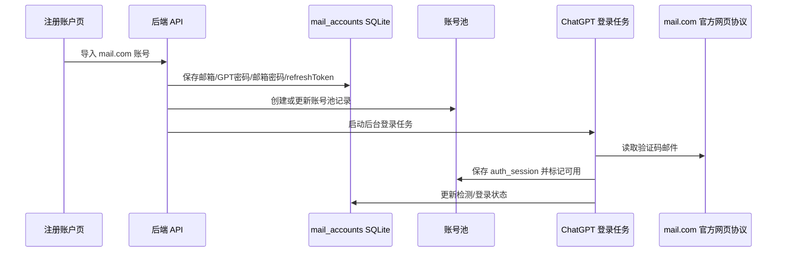
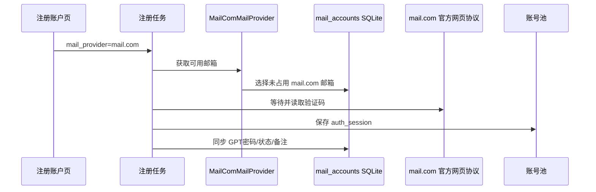

# mail.com 注册供应商与 auth_session 入池设计

## 背景

系统已经有 `mail邮箱管理` 页面，用 SQLite 保存 `mail.com` 邮箱资料，并通过 mail.com 官方网页协议完成取件、状态检测和改密。注册账户页当前支持 Outlook 邮箱池，用户希望新增 `mail.com` 邮件供应商，使导入的 mail.com 账号可以像 Outlook 一样被注册流程使用，并且导入后自动登录 ChatGPT 获取 `auth_session`，最终显示在账号池中。

## 目标

1. 注册账户页新增邮件供应商 `mail.com`。
2. 支持按 `邮箱----GPT密码----邮箱密码----refreshToken` 导入 mail.com 邮箱池。
3. 导入后写入现有 `mail_accounts` SQLite 表。
4. 导入后自动同步到账号池，并启动 ChatGPT 登录以获取 `auth_session`。
5. 登录验证码邮件由 mail.com 官方网页协议取件，不依赖第三方接口。
6. 成功获取 `auth_session` 的账号显示在账号池中，失败账号可重试。
7. 使用 `mail.com` 供应商注册 ChatGPT 时，从 mail.com 邮箱池取号、取验证码、注册成功后同步到账号池和 mail邮箱管理。

## 非目标

1. 不实现 OTP 接入按钮。
2. 不引入 Playwright 或浏览器自动化作为 mail.com 取件方案。
3. 不新增独立数据库；复用现有 SQLite 存储。
4. 不改变 Outlook、LuckMail、Cloudflare、Cloud-Mail 的既有流程。

## 推荐方案

采用“SQLite 邮箱池 + 注册供应商 + 后台登录入池”的方式实现。

mail.com 账号仍由 `mail_accounts` 表统一管理。注册账户页新增 `mail.com 邮箱池` 卡片，卡片交互参考 Outlook 邮箱池，但数据源改为 SQLite。导入成功后，后端将每个 mail.com 邮箱同步到账号池，并创建后台登录任务。后台登录使用导入时提供的 GPT 密码登录 ChatGPT；如果需要邮箱验证码，则通过 mail.com 官方网页协议读取邮件。登录成功后保存 `auth_session`，并更新账号池状态。

## 主要组件

### 前端

#### `RegisterAccountPage.vue`

新增：

- 邮件供应商选项：`mail.com`
- `mail.com 邮箱池` 状态卡片
- 导入弹窗，支持粘贴和文件导入
- 邮箱池管理弹窗
- 手动“登录并入池 / 重试”按钮
- 邮箱池统计：
  - 总数
  - 可用
  - 已获取 `auth_session`
  - 未登录
  - 登录失败

修改：

- 当供应商为 `mail.com` 时，注册表单不要求域名。
- 注册预览显示“mail.com 邮箱池中选择”。
- 提交注册任务时传递 `mail_provider = "mail.com"`。

### 后端 API

复用或扩展现有 mail 账号 API：

- 导入 mail.com 账号到 `mail_accounts`
- 查询 mail.com 邮箱池状态
- 删除 mail.com 邮箱池账号
- 同步 mail.com 账号到账号池
- 启动 ChatGPT 登录获取 `auth_session`
- 重试指定邮箱登录

API 返回需要包含每个邮箱的入池状态：

- `mail_status`
- `account_pool_status`
- `auth_session_status`
- `last_login_error`
- `updated_at`

### 邮件供应商

新增 `MailComMailProvider`，接入现有 `TemporaryEmailClient` 抽象。

职责：

- 从 `mail_accounts` 中选择可用邮箱。
- 避免选择已注册、已保留、登录失败不可用的邮箱。
- 使用现有 mail.com 网页协议读取验证码邮件。
- 将 mail.com 邮件转换为现有验证码解析流程可用的邮件结构。

### 账号池同步

导入 mail.com 后：

1. 根据邮箱查找账号池记录。
2. 不存在则创建。
3. 存在则更新 GPT 密码、邮件供应商、邮箱密码来源信息。
4. 状态先设为待登录或待验证。
5. 登录成功后保存 `auth_session` 文件路径并标记可用。
6. 登录失败时记录错误，保留账号记录，供用户重试。

注册成功后：

1. 更新 `mail_accounts.gpt_password`。
2. 标记该 mail.com 邮箱已被注册使用。
3. 保存 `auth_session`。
4. 确保账号池中存在该账号。
5. 将账号池状态更新为可用。

## 数据流

### 导入并自动入池

### 注册 ChatGPT

## 状态与错误处理

- 导入格式错误：返回具体失败行号和原因。
- mail.com 登录失败：记录到该邮箱的最后错误，不影响其他邮箱。
- ChatGPT 登录失败：账号保留在账号池，状态为失败，可手动重试。
- 验证码超时：记录超时错误，可重试。
- 邮箱已存在：更新字段而不是重复插入。
- 注册成功但同步账号池失败：返回部分成功，并记录同步错误，允许后续修复。

## 测试计划

### 后端单元测试

1. mail.com 导入解析：
   - 正常四段格式
   - 缺字段
   - 重复邮箱覆盖更新
2. 邮箱池状态统计：
   - 总数
   - 可用数
   - 已有 `auth_session`
   - 登录失败
3. `MailComMailProvider`：
   - 选择可用邮箱
   - 跳过已注册邮箱
   - 邮件结构转换
4. 账号池同步：
   - 导入后创建账号池记录
   - 已存在账号更新密码和供应商
   - 登录成功后保存 `auth_session` 状态
5. 注册成功同步：
   - 更新 `mail_accounts`
   - 更新账号池

### 前端验证

1. 注册页显示 `mail.com` 供应商。
2. 选择 `mail.com` 后显示邮箱池卡片。
3. 导入后刷新统计。
4. 账号池管理弹窗显示 auth_session 状态。
5. 登录失败账号可重试。
6. 提交注册任务时 payload 包含 `mail_provider = "mail.com"`。

## 实施顺序

1. 后端补齐 `mail.com` provider 标识和配置归一化。
2. 实现 `MailComMailProvider`。
3. 增加 mail.com 邮箱池状态、同步账号池、登录入池 API。
4. 注册流程接入 `mail.com` provider。
5. 成功注册后同步 mail邮箱管理和账号池。
6. 前端注册页增加 `mail.com` 邮箱池 UI。
7. 补充测试并手动验证导入、登录、注册链路。

## 验收标准

1. 在注册账户页可以选择 `mail.com`。
2. 可以导入 mail.com 账号，导入数据保存到 SQLite。
3. 导入后账号出现在账号池中。
4. 后台能够为导入账号登录 ChatGPT 并保存 `auth_session`。
5. 已保存 `auth_session` 的账号在账号池中显示为可用。
6. `mail.com` 供应商注册 ChatGPT 时可以成功取邮件验证码。
7. 注册成功账号同步到 mail邮箱管理页面和账号池。
8. 不影响 Outlook 邮箱池既有功能。
