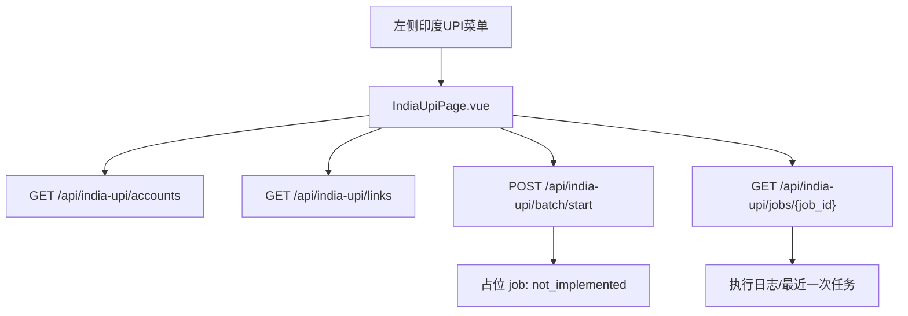

# 印度 UPI 提链页面设计

日期：2026-07-20

## 背景

现有控制台在左侧 `Payments` 分组中已有 `巴西Pix` 页面，包含正式提链、临时提链、支付页、账号池、执行日志、最近结果和链接管理。现在需要在左侧 `巴西Pix` 下方新增独立的 `印度UPI` 页面，并新增一个与 Pix 正式提链页类似的提链页。后端核心提链能力暂时不实现，但需要预留接口契约，避免前端出现 404，并便于后续接入真实 UPI 提链逻辑。

## 目标

- 左侧导航新增 `印度UPI`，位置紧跟 `巴西Pix`。
- 主应用新增页面 key `indiaUpi`，进入独立的 `IndiaUpiPage.vue`。
- `IndiaUpiPage.vue` 提供与 Pix 正式提链页相似的操作布局：任务输入、账号池选择、执行日志、最近一次任务、链接管理。
- 文案和字段切换为印度 UPI：`IN 代理列表`、`印度UPI 提链`、`已提取 UPI 链接` 等。
- 后端新增空实现路由 `/api/india-upi/...`，返回稳定占位响应；核心提链执行暂时标记为待实现。
- 不改动现有 Brazil PIX 行为。

## 非目标

- 不实现真实 UPI 提链流程、浏览器自动化或远程支付服务调用。
- 不接入真实 UPI CDK/支付回调。
- 不重构 `BrazilPixPage.vue` 为公共组件，以避免扩大改动范围。
- 不迁移既有 Pix 数据文件。

## 前端设计

### 导航入口

修改 `web/src/components/Sidebar.vue`：

- 在 `Payments` 分组中 `brazilPix` 后新增：
  - `key: 'indiaUpi'`
  - `glyph: 'UP'`
  - `label: '印度UPI'`
  - `mobileLabel: 'UPI'`

修改 `web/src/App.vue`：

- 导入 `IndiaUpiPage.vue`。
- 在页面渲染分支中加入 `currentPage === 'indiaUpi'`。
- 在 `PAGE_KEYS` 中加入 `indiaUpi`，确保刷新后可保持当前页面。

### 页面结构

新增 `web/src/components/IndiaUpiPage.vue`，采用 Pix 正式提链页的视觉语言和交互结构，但保持实现轻量：

1. 顶部状态卡
   - 标题：`印度UPI 提链`
   - 描述：说明当前页面已预留 UI 和接口，核心提链能力待接入。
   - 状态徽标：空闲时显示 `本地服务在线`，任务提交后显示占位任务状态。

2. 任务输入
   - `IN 代理列表` textarea。
   - `并发数` number input，默认 1，最大 10。
   - 高级设置可保留与 Pix 类似的本地代理链、Kookeey 入口、用户名、密码字段，以便后续接真实逻辑时复用用户输入。
   - `开始提链` 按钮调用占位后端接口。
   - `刷新账号/链接` 按钮重新加载账号和链接。
   - `保存代理` 仅保存到 localStorage。

3. 账号池选择
   - 调用 `/api/india-upi/accounts` 获取账号列表。
   - 支持搜索、状态筛选、全选当前、清空选择。
   - 状态字段使用 UPI 命名：`upi_status`、`upi_status_text`、`upi_error`。
   - 后端占位阶段可复用账号池基础数据并统一返回 `未提链` 状态。

4. 执行日志与最近一次任务
   - 开始提链后创建一个占位 job。
   - 轮询 `/api/india-upi/jobs/{job_id}`。
   - job 状态可为 `pending`、`running`、`success`、`failed`、`cancelled`、`not_implemented`。
   - 当前空实现默认快速结束为 `not_implemented`，日志显示 `印度UPI 后端核心提链功能待接入`。

5. 链接管理
   - 调用 `/api/india-upi/links`。
   - 支持刷新、导出 JSON、删除选中、清空。
   - 当前占位阶段返回空列表；删除/清空接口返回删除数量 0。

## 后端设计

新增 `src/autotoken/api_routes/india_upi.py`。

### 数据文件

预留两个 JSON 数据文件路径：

- `data/india_upi_links.json`
- `data/india_upi_account_status.json`

占位接口使用安全读写：文件不存在时返回空列表或空对象。

### 路由契约

新增 `create_india_upi_router()`，注册以下接口：

- `GET /api/india-upi/accounts`
  - 返回 `{ "accounts": [...] }`。
  - 账号来自现有账号池，补充 UPI 状态字段，默认 `pending/未提链`。

- `POST /api/india-upi/start`
  - 入参包含 `accountEmail`、`proxies`、`concurrency`、高级代理字段。
  - 返回 `{ "job_id": "..." }`。
  - 当前创建占位 job，并标记为待实现。

- `POST /api/india-upi/batch/start`
  - 入参包含 `accountEmails`、`maxAccounts`、`proxies`、`concurrency`、高级代理字段。
  - 返回 `{ "job_id": "..." }`。
  - 当前创建占位 job，并标记为待实现。

- `GET /api/india-upi/jobs/{job_id}`
  - 返回 job 快照。
  - 占位 job 包含日志、状态、result。

- `POST /api/india-upi/jobs/{job_id}/cancel`
  - 将未结束 job 标记为 `cancelled`。

- `GET /api/india-upi/links`
  - 返回 `{ "links": [...] }`。

- `POST /api/india-upi/links/delete`
  - 入参 `{ "ids": [...] }`。
  - 删除匹配链接，返回删除数量。

- `POST /api/india-upi/links/clear`
  - 清空链接文件，返回删除数量。

修改 `src/autotoken/interfaces/api.py`：

- 导入并 `include_router(create_india_upi_router())`。

修改 `web/src/api.js`：

- 新增 `getIndiaUpiAccounts`、`startIndiaUpiBatch`、`getIndiaUpiJob`、`cancelIndiaUpiJob`、`getIndiaUpiLinks`、`deleteIndiaUpiLinks`、`clearIndiaUpiLinks`。

## 数据流

## 错误处理

- 前端 API 调用失败时在页面状态区显示错误消息。
- 未选择账号时不提交任务，并提示先选择账号。
- 后端占位提链接口不抛 501，以免前端流程中断；它返回可轮询 job，job 结果里明确 `implemented: false`。
- 未找到 job 时返回 404。
- 删除链接接口对空 id 列表返回删除数量 0。

## 测试计划

- Python 单元测试：新增 `tests/unit/test_india_upi_routes.py`，覆盖账号接口、占位启动、job 查询、取消、链接删除/清空。
- 前端构建：运行 web 构建或现有前端测试命令，确认新增组件和 API 名称无编译错误。
- 后端测试：运行新增后端单测，并在可接受时间内运行相关 API route 单测。

## 验收标准

- 左侧 `Payments` 下 `巴西Pix` 后显示 `印度UPI`。
- 点击 `印度UPI` 可进入新页面，刷新后仍停留在该页面。
- 页面布局与 Pix 正式提链页相似，并使用 UPI 文案。
- 点击刷新可加载账号和空链接列表，不出现 404。
- 选择账号后点击开始提链，会生成占位 job，页面显示待实现日志和结果。
- 不影响现有 `巴西Pix` 页面、接口和数据文件。

## 自审结果

- 无 TBD/TODO 占位词；“待实现”仅用于描述本次明确要求的空后端核心功能状态。
- 前端 page key、API helper、后端 route prefix 命名一致为 `indiaUpi` / `india-upi`。
- 范围聚焦在新增独立 UPI 页面和空接口，不包含真实提链逻辑或 Pix 重构。
- 错误处理和验收标准均可测试。
