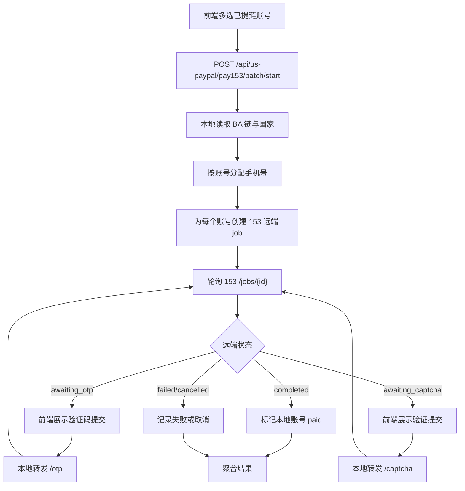

# 153支付批量协议支付设计

日期：2026-08-07

## 背景

现有 `web/src/components/UsPaypalPage.vue` 已包含 `PayPal 提链` 和 `协议支付` 两个 tab，并通过本地 FastAPI 路由 `/api/us-paypal/protocol/*` 驱动本地协议支付引擎。用户要求在这两个 tab 旁新增 `153支付`，页面参考现有协议支付页，但内核套接 `https://pay.153.ink/paypal-pay/`。

对 153 页面进行只读抓取后确认：该站点设置了 `X-Frame-Options: DENY`，不能通过 iframe 嵌入。它的前端 `app.js` 调用的主要接口为：

- `GET /paypal-pay/api/supported-countries`
- `GET /paypal-pay/api/stats`
- `GET /paypal-pay/api/jobs`
- `POST /paypal-pay/api/jobs`
- `GET /paypal-pay/api/jobs/{jobId}?log_offset=0`
- `POST /paypal-pay/api/jobs/{jobId}/otp`
- `POST /paypal-pay/api/jobs/{jobId}/captcha`
- `POST /paypal-pay/api/jobs/{jobId}/cancel`
- `GET /paypal-pay/api/jobs/{jobId}/browser/frame`
- `POST /paypal-pay/api/jobs/{jobId}/browser/action`

用户已批准方案 A：本地 UI + 后端代理 153 接口，并要求支持多选已提链账号批量提交。

## 目标

新增一个 `153支付` tab，使操作员可以从已提链账号中多选账号，批量把每个账号的 BA 链、国家、手机号和代理池提交到 153 远端协议支付接口。本地页面聚合远端任务状态、日志、结果，并在远端授权成功后将本地 PayPal 账号状态标记为 `paid`。

## 非目标

- 不 iframe 嵌入 153 页面。
- 不复制 153 的完整视觉站点；只复用当前 AutoToken 支付页设计语言。
- 不在前端直接跨域调用 153 接口。
- 不改变现有 `PayPal 提链` 和 `协议支付` 行为。
- 不实现 153 私有 Braintree Vault 模式。

## 架构

### 前端

在 `web/src/components/UsPaypalPage.vue` 内新增第三个 tab：`153支付`。

该 tab 复用现有协议支付页的结构：

1. 左侧参数面板
   - 已提链账号表格，支持按国家过滤、多选、全选当前、清空选择。
   - 手机号输入，按行分配给选中的账号。
   - 代理池输入，按 153 要求传数组；最多 500 条。
   - Buyer 身份模式，默认 `identity_elevation`，可选 `original`。
   - 并发数，控制本地同时创建/轮询远端 153 job 的数量。
2. 右侧状态面板
   - 聚合进度：总数、完成数、成功数、失败数、等待验证码数、等待验证数。
   - 当前任务日志：按账号前缀显示远端日志。
   - 等待操作队列：当任一子任务进入 `awaiting_otp` 或 `awaiting_captcha`，显示对应账号和提交控件。
3. 结果面板
   - 成功列表、失败列表、取消/跳过列表。
   - 每个成功项保留远端 result 摘要、本地账号邮箱、国家、BA token。

前端 API 封装新增：

- `startUsPaypal153Batch(payload)` → `POST /api/us-paypal/pay153/batch/start`
- `getUsPaypal153Job(jobId)` → `GET /api/us-paypal/pay153/jobs/{jobId}`
- `cancelUsPaypal153Job(jobId)` → `POST /api/us-paypal/pay153/jobs/{jobId}/cancel`
- `submitUsPaypal153Otp(jobId, remoteJobId, value)` → `POST /api/us-paypal/pay153/jobs/{jobId}/otp`
- `submitUsPaypal153Captcha(jobId, remoteJobId, value)` → `POST /api/us-paypal/pay153/jobs/{jobId}/captcha`
- `getUsPaypal153SupportedCountries()` → `GET /api/us-paypal/pay153/supported-countries`
- `getUsPaypal153Stats()` → `GET /api/us-paypal/pay153/stats`

### 后端

在 `src/autotoken/api_routes/us_paypal.py` 新增 pay153 路由与任务执行器，继续复用现有 `JOBS` 存储和 `_job_snapshot` 格式，避免新增全局任务系统。

新增请求模型：

- `UsPaypal153BatchStartRequest`
  - `accountEmails: list[str]`
  - `phone: str`：多行手机号
  - `proxies: str | list[str]`：代理池
  - `buyerMode: str = "identity_elevation"`
  - `concurrency: int = 1`

新增本地 job 行为：

1. 从 `data/us_paypal_links.json` 根据邮箱查找有效 BA 链。
2. 从链接记录读取国家；如果缺失，则使用请求默认国家或 `US`。
3. 将手机号按账号顺序分配；数量必须不少于选中账号数。
4. 对每个账号调用 153：
   - `POST https://pay.153.ink/paypal-pay/api/jobs`
   - body：`paypal_url`、`phone`、`country`、`proxies`、`agreement_only: false`、`buyer_mode`
5. 保存本地子任务状态：本地账号邮箱、远端 job id、国家、BA token、status、stage、logs、result、error、awaiting flags。
6. 轮询远端：
   - `GET /jobs/{remoteJobId}?log_offset=0`
   - terminal: `completed` / `failed` / `cancelled`
   - interactive: `awaiting_otp` / `awaiting_captcha`
7. 成功后调用现有 `_mark_account_plus_paypal` 和 `_set_account_status(email, PAYPAL_STATUS_PAID, job_id=localJobId)`。
8. 聚合本地 job：全部 terminal 后进入 `success`（有成功或取消）或 `error`（全部失败）。

新增交互透传：

- OTP：本地接口接收 `{ remoteJobId, value }`，校验 remote job 属于该本地 job 后转发到 153 `/jobs/{remoteJobId}/otp`。
- Captcha：同上，转发到 `/captcha`。
- Cancel：对本地未终止子任务逐个转发 `/cancel`，并设置本地 `cancel_requested`。

### 153 HTTP Client

建议在同一文件中先实现小型私有 helper，后续如扩大复用再抽到 `services/pay153_client.py`：

- `_pay153_request(method, path, payload=None, timeout=30)`
- `_pay153_create_job(...)`
- `_pay153_get_job(remote_job_id)`
- `_pay153_submit_otp(remote_job_id, value)`
- `_pay153_submit_captcha(remote_job_id, value)`
- `_pay153_cancel_job(remote_job_id)`

客户端使用 Python 标准库或项目已有 HTTP 库；不新增依赖。错误响应统一转成本地 job error 文本，并做日志脱敏：不展示完整代理密码。

## 数据流

## 错误处理

- 无选中账号：返回 400 `请选择要使用 153 支付的已提链账号`。
- 账号没有有效 BA 链：跳过并写入 errors；若全部无效则 400。
- 手机号行数不足：返回 400，阻止创建远端任务。
- 代理池为空：返回 400，因为 153 前端要求至少一条代理。
- 远端创建 job 失败：该账号进入 failed，继续处理其他账号。
- 远端轮询失败：记录错误并重试少量次数；持续失败则该子任务 failed。
- OTP/Captcha 透传时 remote job 不属于本地 job：返回 400。
- 本地取消：尽量取消所有仍可取消的远端任务；已完成的保留成功结果。

## 测试计划

### 后端单测

新增或扩展 `tests/unit/test_us_paypal_routes.py`：

1. pay153 batch start 校验手机号数量、代理池、已提链账号。
2. mock 153 create/get job，验证每个账号提交 body 包含 `paypal_url`、`phone`、`country`、`proxies`、`buyer_mode`。
3. 远端 `completed` 后本地账号状态变为 `paid`。
4. 远端 `awaiting_otp` 时本地 job snapshot 暴露等待操作项。
5. OTP/Captcha 接口只允许提交属于该本地 job 的 remote job。
6. cancel 会转发到所有未终止远端 job。

### 前端静态测试

新增 `web/scripts/test-paypal-153-ui.mjs`：

1. 页面包含 `153支付` tab。
2. 包含 `pay153Form`、多选已提链账号、手机号按行提示、代理池提示。
3. 批量提交调用 `api.startUsPaypal153Batch`。
4. API 封装包含 pay153 start/job/cancel/otp/captcha。
5. 校验手机号行数不足、未选账号、代理为空时阻止提交。

### 构建验证

- `cd web && npm run test:paypal-153-ui`
- `cd web && npm run build`
- 相关 Python 单测：`python -m pytest tests/unit/test_us_paypal_routes.py -q`

## 视觉与交互原则

视觉 thesis：延续当前 PayPal 页暗色控制台、圆角边框、状态徽章和高对比表格，不引入新的设计系统。

内容顺序：tab 切换 → 153 状态概览 → 批量参数 → 实时日志/等待操作 → 聚合结果。

交互：

- 切换到 `153支付` 不清空现有 `PayPal 提链` 和 `协议支付` 输入。
- 提交后按钮进入 loading，右侧持续轮询。
- 多个账号等待验证码时，以队列形式逐条显示，避免只显示最后一个。
- 成功、失败、取消都有明确徽章和结果区。

## 交付范围

预计修改文件：

- `web/src/components/UsPaypalPage.vue`
- `web/src/api.js`
- `web/scripts/test-paypal-153-ui.mjs`
- `web/package.json`
- `src/autotoken/api_routes/us_paypal.py`
- `tests/unit/test_us_paypal_routes.py`

