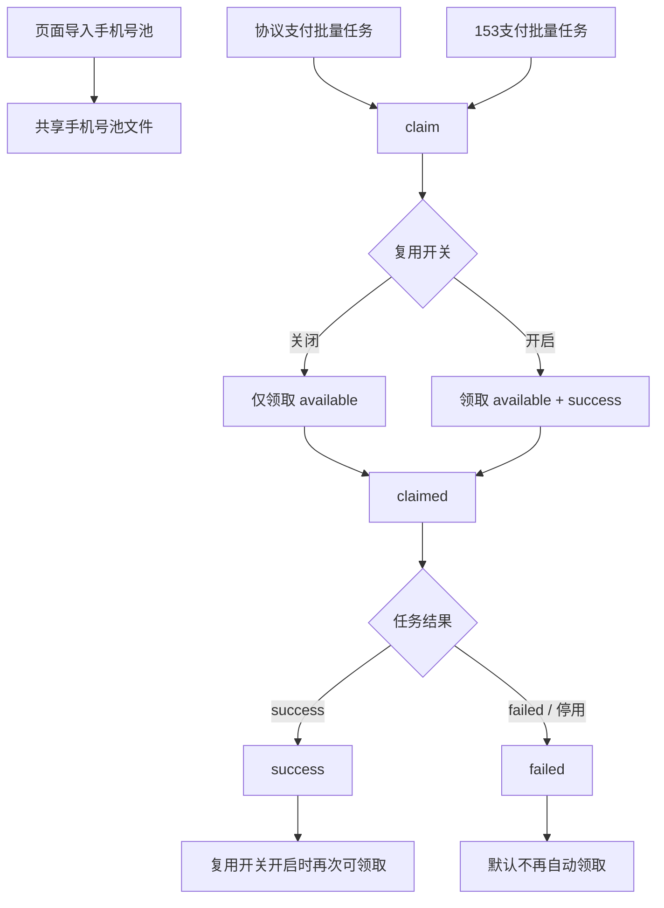

# PayPal 手机号池统一管理设计

日期：2026-08-07

## 背景

当前 `协议支付` 和 `153支付` 都支持 `sms_record` 号池导入，但两边都是各自解析一段文本并在任务开始时临时领取号码，缺少统一管理、状态追踪和复用控制。

用户希望把协议支付和 153 支付都改成同一套手机号池机制，新增：

- 手机号池管理
- 每个手机号有状态
- 一个全局“开启手机号复用”开关，默认关闭
- 复用开关对 `sms_record`、`hero_sms`、`smsbower`、`hero_sms_rent` 统一生效

其中手机号池导入格式仍保持为：

```text
+447383370667----https://api.sms8.net/api/record?token=...
```

## 目标

- 协议支付和 153 支付共用同一手机号池。
- 手机号池可在页面中集中管理，而不是只靠两个输入框。
- 每个手机号都能看到当前状态。
- 默认关闭手机号复用；关闭时一号一用，用完即抛。
- 打开手机号复用后，成功号码可再次被领取。
- 批量并发时，领取手机号必须线程安全，不能重复分配。
- 关闭复用时，`smsbower` / `hero_sms` / `hero_sms_rent` 也不允许复用历史号码。

## 非目标

- 不改动 PayPal 提链页逻辑。
- 不改动 153 远端接口协议。
- 不做独立的手机号供应商市场聚合。
- 不引入新的数据库，继续沿用本地文件存储。

## 设计概览

### 单一手机号池

新增一个共享手机号池作为协议支付和 153 支付的唯一手机号来源。

手机号池中的一条记录表示一组手机号 + SMS record URL 绑定关系。记录以手机号为主键，URL 可更新。

### 统一管理面板

在 `UsPaypalPage.vue` 中新增一个 `手机号池管理` 面板，放在协议支付 / 153 支付 tab 上方或旁侧的公共区域。

面板提供：

- 导入手机号池
- 查看统计
- 筛选状态
- 修改状态
- 删除/停用
- 全局复用开关

### 共享领取服务

后端新增一个共享池服务，协议支付和 153 支付都通过它领取号码。

领取时按以下规则：

- 先领取 `可用` 号码
- 若复用开关开启，可将 `成功` 号码再次纳入可领取集合
- `失败/停用` 默认不自动复用
- `已领取` 仅表示当前任务占用中，不能被其它并发任务重复领取
- 复用开关关闭时，所有来源都只能按一次性号码处理，不能命中历史缓存

## 数据模型

建议新增一个单独的本地数据文件，例如：

- `data/us_paypal_phone_pool.json`

建议结构：

```json
{
  "settings": {
    "reuse_enabled": false
  },
  "items": [
    {
      "id": "uuid",
      "phone": "+447383370667",
      "sms_record_url": "https://api.sms8.net/api/record?token=...",
      "status": "available",
      "claimed_by": "",
      "claimed_at": null,
      "last_used_at": null,
      "last_result": "",
      "use_count": 0,
      "updated_at": 0
    }
  ]
}
```

### 状态定义

采用 4 个状态：

- `available`：可领取
- `claimed`：已领取，正在执行中
- `success`：本次使用成功
- `failed`：本次使用失败或停用

说明：

- `claimed` 是运行中状态。
- `success` / `failed` 是终态。
- 当复用开关开启时，`success` 记录再次可被领取。
- 当复用开关关闭时，`success` 和 `failed` 都保持终态，不再自动回池。

## 状态流转

### 关闭复用

1. 导入号码 → `available`
2. 批量任务领取 → `claimed`
3. 任务成功 → `success`
4. 任务失败 / 停用 → `failed`
5. 终态号码不再被自动领取
6. `hero_sms` / `smsbower` / `hero_sms_rent` 的历史可复用号码也不再命中

### 开启复用

1. 导入号码 → `available`
2. 批量任务领取 → `claimed`
3. 任务成功 → `success`
4. `success` 号码再次成为可领取候选
5. 任务失败 / 停用仍保留 `failed`，默认不复用

这样既保留状态可读性，也避免把明显坏号自动回池。

## 前端设计

### 管理面板

新增公共 `手机号池管理` 区域，和协议支付 / 153 支付共享。

内容建议：

1. 顶部统计
   - 总数
   - 可用
   - 已领取
   - 成功
   - 失败/停用
   - 当前复用开关状态

2. 导入区
   - 支持粘贴多行 `手机号----SMS record URL`
   - 支持批量导入合并
   - 重复手机号默认按手机号去重更新 URL

3. 列表区
   - 手机号
   - SMS record URL
   - 状态
   - 最近领取人 / 最近任务
   - 领取次数
   - 操作：启用、停用、删除、重置为可用

4. 全局开关
   - `开启手机号复用`
   - 默认关闭

### 协议支付 / 153 支付页

两边不再依赖各自独立的手机号池语义，改为：

- 任务开始前显示“当前可领取手机号数量”
- 触发批量任务时从共享池领取
- 保留兼容性的 `phonePool` 文本导入入口可以作为快捷导入，但最终落到同一共享池

这样用户在任意一页导入号码，另一页都能立即使用同一池。

## 后端设计

建议将手机号池逻辑从 `src/autotoken/api_routes/us_paypal.py` 中抽成一个独立服务模块，例如：

- `src/autotoken/services/us_paypal_phone_pool.py`

该服务负责：

- 读取 / 写入池文件
- 导入解析
- 并发领取
- 状态更新
- 复用规则判断

### 共享 API

建议新增：

- `GET /api/us-paypal/phone-pool`
- `POST /api/us-paypal/phone-pool/import`
- `POST /api/us-paypal/phone-pool/claim`
- `POST /api/us-paypal/phone-pool/{id}/release`
- `PATCH /api/us-paypal/phone-pool/{id}`
- `POST /api/us-paypal/phone-pool/{id}/disable`
- `POST /api/us-paypal/phone-pool/{id}/enable`
- `DELETE /api/us-paypal/phone-pool/{id}`
- `PATCH /api/us-paypal/phone-pool/settings`

### 领取规则

领取时必须在文件锁内完成：

1. 读入池数据
2. 根据复用开关筛选可领取项
3. 按稳定顺序取一条
4. 立即改为 `claimed`
5. 写回文件

协议支付和 153 支付的并发批量任务都要复用这套领取逻辑，不能各自 pop 自己的文本池。
`hero_sms` / `smsbower` / `hero_sms_rent` 的历史复用缓存也要受同一开关控制，关闭时不得再次返回旧 activation。

### 兼容性

现有接口里的 `phonePool` 字段继续保留，作为兼容导入入口：

- 有值时：先导入到共享池
- 再按共享池领取

这样不会破坏老的提交方式，也方便前端渐进迁移。

## 数据流



## 错误处理

- 导入格式不合法：跳过该行并在 UI 提示。
- 号码为空或 URL 为空：该行无效，不写入池。
- 领取时池为空：返回“手机号池已领完”。
- 并发抢号：同一号码在同一时刻只能被一个任务领取。
- 任务执行前失败：领取记录可回退为 `available`。
- 任务执行后失败：记录为 `failed`，默认不复用。
- 关闭复用时，`hero_sms` / `smsbower` / `hero_sms_rent` 也必须按一次性号码处理。

## 测试计划

### 后端单测

覆盖：

1. 导入解析 `手机号----URL`
2. 重复手机号导入时的合并规则
3. 关闭复用时，`success/failed` 不再被领取
4. 开启复用时，`success` 可再次领取
5. 并发批量领取不会重复分配
6. 协议支付和 153 支付共用同一池
7. 关闭复用时，`hero_sms` / `smsbower` / `hero_sms_rent` 也不命中历史缓存

### 前端测试

覆盖：

1. 页面出现手机号池管理面板
2. 复用开关默认关闭
3. 列表能展示状态
4. 导入格式文案包含 `手机号----SMS record URL`
5. 协议支付和 153 支付都显示同一池统计

## 验收标准

- 协议支付和 153 支付共享同一手机号池。
- 管理面板能看到每条手机号状态。
- 默认关闭复用时，号码只用一次。
- 开启复用后，成功号码可以再次被领取。
- 并发任务不会抢到同一手机号。
- 关闭复用时，`hero_sms` / `smsbower` / `hero_sms_rent` 也不会复用历史号码。

## 影响文件

预期会修改：

- `web/src/components/UsPaypalPage.vue`
- `web/src/api.js`
- `src/autotoken/api_routes/us_paypal.py`
- 新增手机号池服务模块
- `tests/unit/test_us_paypal_routes.py`
- 新增前端静态测试脚本
